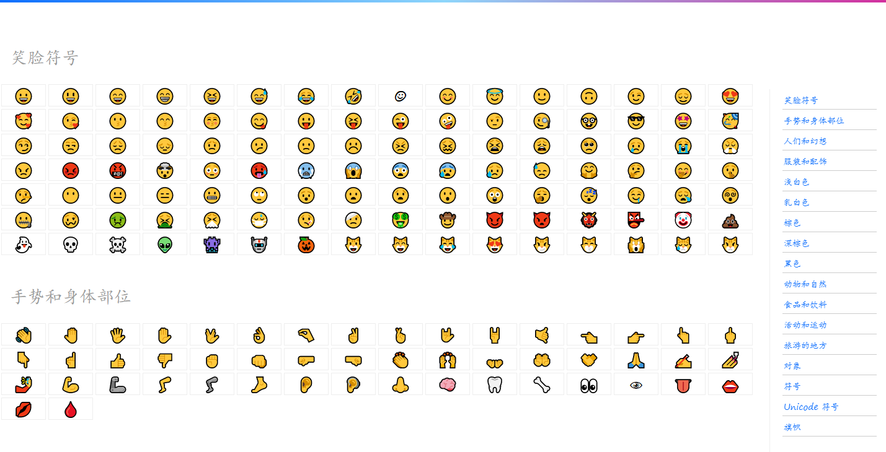

一个简单的 Emoji 符号复制页 🎉 -- [Emojing](https://ovirgo.com/emojing)

## 用法

它本身就是一个工具页，你可以很方便地使用它 [Emojing](https://ovirgo.com/emojing) 。

配置 `config.js` ：

```js
export default {
	en: false
}
```

默认为中文界面，如果你想设置为英文，设置 `en: true` 即可。

## 预览

  
